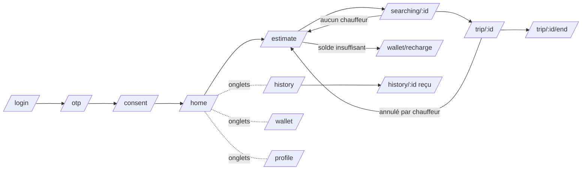
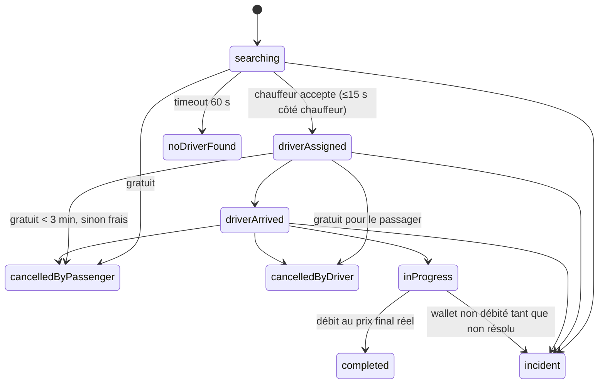

# Spécification — Application passager (VTC) · TACO EDEN MOBILITY

> **Source unique : le cahier des charges « Application de VTC », v1.0 du 10/08/2026, statut « à valider »** (ci-dessous « CdC »).
> Comme demandé, l'annexe d'agrément « Application EDEN Mobility » (mai 2026) **n'a pas été suivie**. Les écarts entre les deux documents sont listés au §7.
> Légende : **[CdC]** = exigence écrite dans le CdC · **[HYP]** = hypothèse de conception à valider · **[OUVERT]** = décision de l'entreprise nécessaire.

---

## 1. Périmètre de l'application passager

| Fonction | Référence | Écran(s) |
|---|---|---|
| Inscription : téléphone → OTP SMS → compte → wallet à 0, non éligible au crédit → consentement explicite | [CdC §2.2] | `/login`, `/otp`, `/consent` |
| Wallet : recharge Orange Money / MTN MoMo, solde, historique, statuts | [CdC §2.2, §4.3] | `/wallet`, `/wallet/recharge` |
| Commande : position + destination, estimation prix/durée, vérification wallet, recherche avec timeout 60 s | [CdC §2.2] | `/home`, `/estimate`, `/searching/:id` |
| Pendant la course : suivi GPS temps réel, numéros masqués, SOS permanent + contact d'urgence | [CdC §2.2] | `/trip/:id` |
| Fin de course : débit au prix réel, alerte si dépassement > 30 %, note 1–5, reçu | [CdC §2.2] | `/trip/:id/end`, `/history/:id` |
| Bilingue FR / EN | décision du 08/10/2026 | toute l'app |

Hors périmètre de cette app : l'interface chauffeur, l'interface admin (web) et le backend NestJS (**ils restent à construire**).

## 2. Navigation

Redirections automatiques (`app_router.dart`) : non connecté → `/login` ; consentement absent → `/consent`.

## 3. Cycle de vie d'une course

Les noms des états sont **[HYP]** : le CdC décrit les étapes sans nommer les statuts. La table `allowedTripTransitions` (`lib/domain/models/trip.dart`) est la référence et est testée.

## 4. Règles métier implémentées

| Règle | Implémentation | Statut |
|---|---|---|
| Prix = prise en charge + tarif_km × distance ; max(prix, minimum) | `domain/rules/pricing.dart` → `computeFare` | [CdC §3.1] — arrondi à l'unité **[HYP]** |
| Alerte si prix final > estimation × 1,30 (strictement) | `isFareOverrun` (calcul en entiers) | [CdC §2.2] |
| Annulation gratuite avant acceptation ou < 3 min après | `domain/rules/cancellation.dart` | [CdC §3.2] |
| Ensuite : frais proportionnels plafonnés à 10 min | `feePerMinute × min(minutes, 10)` | **[HYP]** voir §6-3 |
| Pas d'annulation une fois le passager à bord | `notAllowed` | **[HYP]** |
| Vérification wallet : suffisant / crédit d'urgence / refus | `domain/rules/wallet_check.dart` | [CdC §2.2, §2.6] + **[HYP]** voir §6-5 |
| Crédit : 1 fois / 7 jours glissants, plafonné, compte bloqué si solde < 0, suspension globale | `wallet_check.dart`, `Wallet.isBlocked` | [CdC §2.6] |
| Ledger immuable (on ajoute, on ne modifie jamais) | `MockBackend._record` | [CdC §4.4] |
| Montants en entiers FCFA | partout (`int`) | bonne pratique |

**Principe de sécurité :** l'application *affiche* ces règles mais **le backend décide** (prix, frais, éligibilité, débit). Le `MockBackend` refait la vérification du wallet au moment de `requestTrip`, comme devra le faire l'API.

## 5. Contrat API proposé pour le backend NestJS — **[HYP]**

Le CdC fixe la stack (NestJS, PostgreSQL + PostGIS, Redis, Socket.io) et les modules, mais **aucun endpoint**. Proposition alignée sur `lib/data/repositories.dart` :

| Méthode de l'app | REST proposé | Module CdC |
|---|---|---|
| `requestOtp` / `verifyOtp` | `POST /auth/otp/request` · `POST /auth/otp/verify` → JWT | Auth |
| `giveConsent` | `POST /users/me/consent` | Users |
| `updateEmergencyContact` | `PATCH /users/me` | Users |
| `watchWallet` / `watchTransactions` | `GET /wallet` · `GET /wallet/transactions?cursor=` + événement socket `wallet:updated` | Wallet |
| `recharge` | `POST /payments/topups` {operator, phone, amount} → statut `pending` ; webhook opérateur → `wallet:updated` | Payments |
| `checkWallet` | `POST /wallet/check` {estimatedPrice} | Wallet |
| `fetchConfig` | `GET /config/public` (tarifs, seuils, timeouts) | Admin / Pricing |
| `estimate` | `POST /trips/estimate` {pickup, destination} | Pricing + Geo |
| `requestTrip` | `POST /trips` {pickup, destination, estimateId, useEmergencyCredit} | Trips |
| `watchTrip` | socket : salle `trip:{id}`, événements `trip:status`, `trip:driver_location` | Trips + Geo |
| `quoteCancellation` / `cancelTrip` | `GET /trips/{id}/cancellation-quote` · `POST /trips/{id}/cancel` | Trips |
| `rateTrip` | `POST /trips/{id}/rating` | Trips |
| `sendSos` / `reportIssue` | `POST /trips/{id}/sos` · `POST /trips/{id}/incidents` | Admin (Incidents) |

Point d'attention : `estimate` devrait renvoyer un `estimateId` signé et daté côté serveur, pour que le client ne puisse pas envoyer un prix modifié.

## 6. Points ouverts et incohérences du CdC (à trancher avant la tranche 4)

| # | Constat | Risque | Choix provisoire dans le code |
|---|---|---|---|
| 1 | **Aucun tarif chiffré** (prise en charge, tarif/km, minimum) — CdC §9 | Élevé | Valeurs **fictives** dans `AppConfig.demoRules` |
| 2 | **Tarif à la minute** : absent de la formule §3.1, mais cité en §4.4 (`Pricing_config`) et §9 | Moyen | Formule §3.1 seule (sans minute) |
| 3 | **Frais d'annulation** : « après 3 min **ou** chauffeur déjà en route » contredit la gratuité < 3 min (le chauffeur roule dès l'acceptation). « 10 minutes de trajet équivalent » n'a pas de tarif/minute défini | Moyen | Critère 3 min seul ; `feePerMinute` fictif |
| 4 | **Formule du trust score** (§2.6) : le texte cite l'**ancienneté du compte**, la formule ne la contient pas ; `nb_courses_7j / seuil` n'est pas plafonné à 1 → score > 1 possible | Moyen | Hors app passager (backend) — à corriger dans le CdC |
| 5 | « **Solde suffisant** » : par rapport à l'estimation ? à l'estimation + marge ? Le crédit couvre-t-il le manque ou toute la course ? | Moyen | Solde ≥ estimation ; le crédit couvre le manque |
| 6 | **Prix final > solde** sans crédit d'urgence (ex. dépassement) : le solde devient négatif → compte bloqué, alors que le passager n'a pas choisi de crédit | Moyen | Débit quand même, solde négatif, compte bloqué |
| 7 | Annulation pendant la course (`inProgress`) non traitée | Faible | Interdite (SOS toujours disponible) |
| 8 | **Géocodage / recherche d'adresse** non spécifiés (le CdC dit seulement « saisie destination ») | Moyen | Clic sur la carte + raccourcis de démo |
| 9 | **Fournisseurs** non choisis : SMS OTP, masquage des numéros, tuiles cartographiques, calcul d'itinéraire | Moyen | Simulés |
| 10 | Règle d'**arrondi** des prix (pas de 25/50 FCFA ?) | Faible | Arrondi à l'unité |
| 11 | Montant **minimum / maximum de recharge** non fixés | Faible | Minimum fictif 100 FCFA |
| 12 | Conformité : statut juridique du wallet, protection des données, texte du consentement — CdC §9 | **Élevé** | Texte provisoire signalé dans l'écran |

## 7. Écarts CdC ↔ annexe d'agrément (non retenus, pour information)

L'annexe « Application EDEN Mobility » (mai 2026) mentionne : flotte **électrique**, dispatch vers le véhicule « le mieux chargé », intégration **EDEN CHARGE (OCPP 2.0.1)**, paiement par **carte**, **partage du trajet** avec un proche, **notation du véhicule**. Rien de cela n'est dans le CdC. Si ces éléments sont maintenus dans le dossier d'agrément, il faudra **mettre le CdC à jour**. Sinon, l'application livrée ne correspondra pas à ce qui a été présenté.

## 8. Ce qui est simulé (`lib/data/mock/mock_backend.dart`)

- OTP : code `123456`.
- Distance routière ≈ vol d'oiseau × 1,3 ; vitesse moyenne 20 km/h **[HYP]**.
- Chauffeur trouvé en 6 s, ~15 s pour arriver, 5 s d'attente, ~25 s de trajet en ligne droite.
- Prix final = estimation + 0 à 15 % (ou + 40 % avec l'interrupteur « dépassement »).
- Recharge validée en 2,5 s.
- Interrupteurs du **Profil › Mode démo** : aucun chauffeur, dépassement, éligibilité au crédit, suspension globale des crédits.

## 9. Décisions du 08/10/2026 (hors CdC v1.0)

Ces évolutions ont été demandées en s'inspirant de deux maquettes Dribbble (« Ride Sharing Mobile App UI » de Juice Lab et « Taxi mobile app » de Ledo). Elles **dépassent le CdC v1.0** : le CdC devra être mis à jour pour qu'elles fassent foi.

| Sujet | Décision | Écart avec le CdC |
|---|---|---|
| Style | Base claire et aérée (maquette 1) + écrans de la maquette 2 ; police Poppins ; thèmes clair et sombre (suit le téléphone) ; carte OpenStreetMap standard | CdC muet sur le design |
| Couleurs | Celles du logo : bleu `#1582C3` (boutons principaux), vert `#43B381` (accents) | — |
| Écrans d'introduction | 3 écrans, affichés une seule fois | Ajout |
| Prénom | Demandé à l'inscription, **facultatif** ; accueil « Bonjour [prénom] » | Ajout (CdC : téléphone seul) |
| Accueil | Tuiles Commander / Mon wallet / Mes courses | Ajout |
| Lieux favoris | Maison + Bureau (uniques) + lieux libres nommés | Ajout |
| Gammes | **Éco / Confort**, tarifs séparés (prise en charge, tarif/km, minimum par gamme) | **Contredit** le tarif unique du CdC §3.1 |
| Visuels véhicules | Icônes simples | — |
| Réservation | Entre **1 h et 24 h** à l'avance ; solde vérifié à la réservation, débit en fin de course ; alerte « solde insuffisant » **30 min** avant ; recherche chauffeur **15 min** avant ; si le solde est toujours insuffisant à ce moment : annulation **sans frais** | Ajout |
| Exclus | Paiement espèces/carte, pourboire, services colis/repas | Conforme au CdC (wallet seul, chauffeurs salariés, pas de marchandises) |

**Choix pris faute de précision (à valider) :**
- Le **crédit d'urgence n'est pas utilisable pour une réservation** : le solde doit couvrir le prix estimé. Motif : il est limité à 1 fois / 7 jours et sert un besoin immédiat.
- L'annulation d'une réservation **avant l'acceptation d'un chauffeur est gratuite** (même règle que le CdC §3.2 avant acceptation).
- Les **créneaux de réservation** sont proposés tous les quarts d'heure (pas de saisie libre de l'heure).
- Les **tarifs Confort** de démonstration (800 FCFA + 350 FCFA/km, minimum 1 500 FCFA) sont **fictifs**, comme ceux d'Éco.
